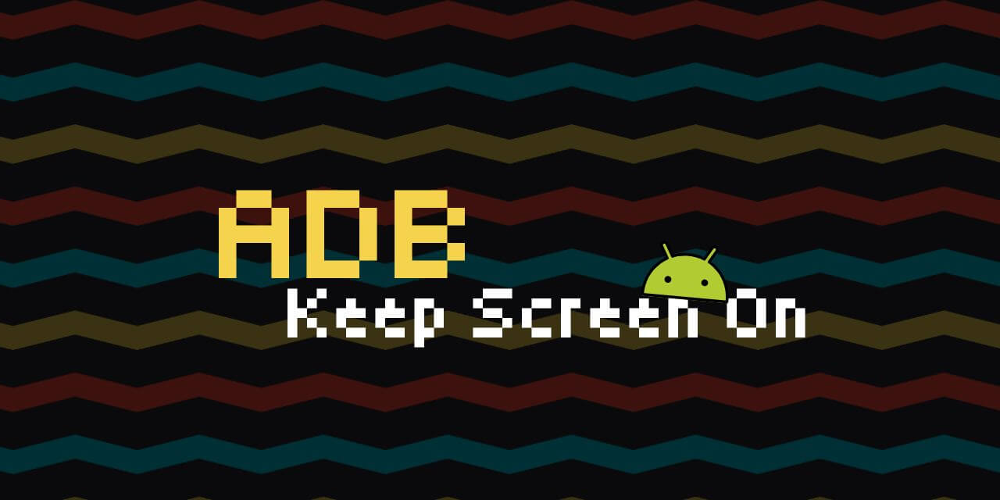

# 📱 ADB Keep Screen On



[](https://github.com/nisrulz/adb-keep-screen-on) [](https://github.com/nisrulz/adb-keep-screen-on/fork) [](https://github.com/nisrulz/adb-keep-screen-on)

[](https://androidweekly.net/issues/issue-693#:~:text=Libraries%20%26%20Code-,adb%2Dkeep%2Dscreen%2Don,-A%20small%20CLI)

[](https://github.com/nisrulz/adb-keep-screen-on) [](https://bsky.app/profile/nisrulz.com) [](https://bsky.app/intent/compose?text=%F0%9F%93%B1%20ADB%20Keep%20Screen%20On%20is%20a%20lightweight%20CLI%20tool%20written%20in%20Go%20that%20prevents%20your%20Android%20device%20from%20sleeping%20when%20connected%20via%20ADB%20over%20USB.%0A%0A%F0%9F%91%A8%F0%9F%8F%BB%E2%80%8D%F0%9F%92%BB%20Built%20by%20%40nisrulz.com%20%0A%0A%E2%9C%85%20Github%3A%20https%3A%2F%2Fgithub.com%2Fnisrulz%2Fadb-keep-screen-on%0A%0A%23AndroidDev%20%23adb%20%23android%23debugging)

**ADB Keep Screen On** is a lightweight CLI tool written in Go that prevents your Android device from sleeping when connected via ADB over USB.

It’s ideal for developers, testers, and presenters who need the screen to stay awake during debugging, automation, or live demos without relying on charging state or manually tweaking device settings.

## ❓ Why This Tool Exists

Android’s developer setting **Stay awake while charging** is too broad and doesn’t cover developer workflows.  Developers have been requesting a more precise option **Stay awake while ADB is connected** since **2016**, but the issue remains unresolved:

🔗 [Google Issue Tracker #37094654](https://issuetracker.google.com/issues/37094654)

This tool fills that gap by monitoring ADB connection status and toggling the screen-on setting only when needed.

## ✨ Features

- Supports multiple connected devices simultaneously (Physical and Emulators both).
- Checks and stores the original stay awake setting for each device before starting, restores it on exit.
- Wakes up the screen when enabling the stay awake debug setting.
- Monitors ADB connection and toggles settings automatically.
- Provides clear CLI feedback and graceful exit (restores settings on Ctrl+C).
- Works with USB ADB connections only.
- Lightweight, fast, and easy to use.

## ⚙️ Prerequisites

- ✅ [Go](https://golang.org/dl/) installed (for building the binary)
- ✅ [ADB (Android Debug Bridge)](https://developer.android.com/tools/adb) installed and accessible in your terminal

### 🧪 Install ADB via Homebrew (macOS)

If ADB is not installed, you can install it using Homebrew:

```sh
brew install --cask android-platform-tools
```

## 🚀 Usage

### 1. Build the binary

```sh
./build.sh
```

The binary will be created in the `dist` directory.

> **Tip:** Prebuilt binaries for each platform are available in the `dist` directory. You can use these directly without building if you prefer.

### 2. (Optional) Install globally

> **Note:** The install.sh script only works for Unix systems such as macOS and Linux.

To run the tool from anywhere, use the provided install script:

```sh
./install.sh
```

This will symlink the binary to `~/bin/adb-keep-screen-on`. If `~/bin` is not in your PATH, follow the instructions printed by the script to add it.

### 3. Run the tool

Ensure your Android device is connected and USB debugging is enabled.

To run the built binary directly:

```sh
./dist/adb-keep-screen-on
```

Or specify a custom polling interval:

```sh
./dist/adb-keep-screen-on --interval 10
```

If you used the install script and symlinked the tool, simply open a new terminal and run:

```sh
adb-keep-screen-on
```

Or with a custom interval:

```sh
adb-keep-screen-on --interval 10
```

If you do not pass the --interval argument, the default polling interval of 10 seconds will be used.

`--interval` (optional): polling interval in seconds (default: `10`)

### Demo

<https://github.com/user-attachments/assets/75c25d2b-4e7e-4914-abe4-ca476018a207>

> When multiple devices are connected, then that is handled too.

```sh
❯ adb-keep-screen-on
🔌 Monitoring ADB connection every 10 seconds to keep screen on...

📱 Device connected via ADB: DEMOR1A04321 . Keeping screen awake.

✅ Device is connected. Screen will stay awake.

📱 Device connected via ADB: DEMOFXR312 . Keeping screen awake.

✅ Device is connected. Screen will stay awake.

^C
🔌 Monitoring stopped. Device settings restored. Exiting...

```

## 📄 License

[Apache License Version 2.0 © Nishant Srivastava](/LICENSE)
