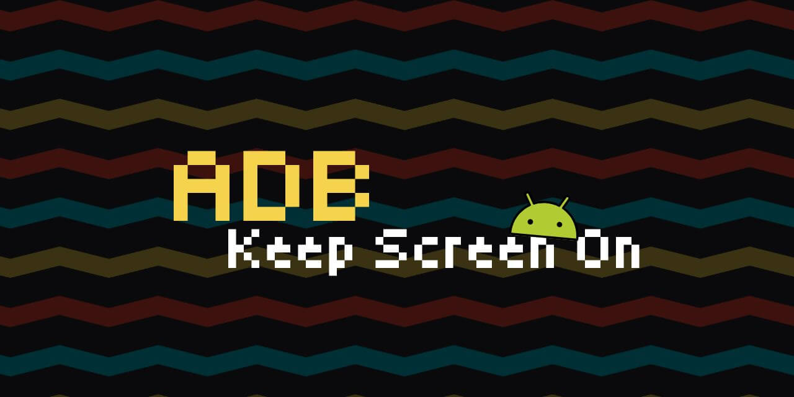

# 📱 ADB Keep Screen On



[](https://github.com/nisrulz/adb-keep-screen-on) [](https://github.com/nisrulz/adb-keep-screen-on/fork) [](https://github.com/nisrulz/adb-keep-screen-on)

[](https://androidweekly.net/issues/issue-693#:~:text=Libraries%20%26%20Code-,adb%2Dkeep%2Dscreen%2Don,-A%20small%20CLI)

[](https://github.com/nisrulz/adb-keep-screen-on) [](https://bsky.app/profile/nisrulz.com) [](https://bsky.app/intent/compose?text=%F0%9F%93%B1%20ADB%20Keep%20Screen%20On%20is%20a%20lightweight%20CLI%20tool%20written%20in%20Go%20that%20prevents%20your%20Android%20device%20from%20sleeping%20when%20connected%20via%20ADB%20over%20USB.%0A%0A%F0%9F%91%A8%F0%9F%8F%BB%E2%80%8D%F0%9F%92%BB%20Built%20by%20%40nisrulz.com%20%0A%0A%E2%9C%85%20Github%3A%20https%3A%2F%2Fgithub.com%2Fnisrulz%2Fadb-keep-screen-on%0A%0A%23AndroidDev%20%23adb%20%23android%23debugging)

**ADB Keep Screen On** is a small CLI tool written in Go. It keeps your Android device's screen awake while the device is connected over ADB, instead of tying that behavior to the charging state.

It helps during debugging, automation, and demos, where you want the screen on without touching the device or changing developer settings by hand.

## Why this tool exists

Android has a "Stay awake while charging" developer option, but that is broader than most workflows need. A more precise "Stay awake while ADB is connected" option has been requested since 2016 and is still unresolved:

[Google Issue Tracker #37094654](https://issuetracker.google.com/issues/37094654)

This tool watches the ADB connection and toggles the setting only while a device is connected.

## Features

- Handles multiple devices at once, physical and emulators.
- Stores each device's original setting and restores it on exit.
- Wakes the screen when it enables the stay-awake setting.
- Polls `adb devices` and reacts to connects and disconnects automatically.
- Configurable through a JSON file: poll interval, wake-on-connect, restore-on-disconnect, and a device allowlist.
- Subcommands for `stop`, `status`, `version`, and `help`.

## Prerequisites

- [ADB (Android Debug Bridge)](https://developer.android.com/tools/adb) installed and on your PATH.
- [Go](https://golang.org/dl/) is only needed if you build from source.

### Install ADB with Homebrew (macOS)

```sh
brew install --cask android-platform-tools
```

## Quick install

### One-liner (macOS / Linux / Windows Git Bash)

```sh
curl -sfL https://github.com/nisrulz/adb-keep-screen-on/releases/latest/download/install.sh | sh
```

No Go needed. The script picks the right binary for your OS and puts it in `/usr/local/bin` (Unix) or `~/bin` (Windows Git Bash).

### Go install

```sh
go install github.com/nisrulz/adb-keep-screen-on@latest
```

Requires [Go](https://go.dev/dl/) 1.25+.

### Build from source

```sh
git clone https://github.com/nisrulz/adb-keep-screen-on.git
cd adb-keep-screen-on
make build
```

## Usage

```sh
adb-keep-screen-on              # Start daemon (runs in background)
adb-keep-screen-on stop         # Stop the daemon
adb-keep-screen-on status       # Show whether the daemon is running
adb-keep-screen-on --foreground # Run in foreground (debug)
adb-keep-screen-on version      # Print the version
adb-keep-screen-on help         # Show usage help

# Or using make:
make start
make stop
make status
make run                        # Foreground (debug)
```

The tool polls `adb devices` to detect plug/unplug events. The polling
interval is configurable (see below). Already-connected devices are detected
immediately on startup.

Daemon logs to `~/.adb-keep-screen-on/debug.log` and saves PID to
`~/.adb-keep-screen-on/PID`.

### Configuration

On first run, a config file is created at `~/.adb-keep-screen-on/config.json`:

```json
{
  "poll_interval_seconds": 1,
  "wake_on_connect": true,
  "restore_on_disconnect": true,
  "devices": []
}
```

| Key | Default | Description |
| --- | --- | --- |
| `poll_interval_seconds` | `1` | How often `adb devices` is polled (minimum 1). |
| `wake_on_connect` | `true` | Wake the screen when a device connects. |
| `restore_on_disconnect` | `true` | Restore the original setting when a device disconnects or the tool exits. |
| `devices` | `[]` | Optional allowlist of device IDs to manage. Empty means all devices. |

### Example output

```sh
❯ adb-keep-screen-on
✅ Started (PID 41234)
   Logs:   /Users/you/.adb-keep-screen-on/debug.log
   Config: /Users/you/.adb-keep-screen-on/config.json
   Stop with: adb-keep-screen-on stop

❯ adb-keep-screen-on status
🟢 Running (PID 41234)
   Logs:   /Users/you/.adb-keep-screen-on/debug.log
   Config: /Users/you/.adb-keep-screen-on/config.json

❯ adb-keep-screen-on --foreground
🔌 Monitoring ADB connection to keep the screen awake
   config:   /Users/you/.adb-keep-screen-on/config.json
   interval: 1s   wake-on-connect: true   restore: true

✅ Connected: DEMOR1A04321: screen will stay awake
🔌 Disconnected: DEMOR1A04321
^C
🔌 Monitoring stopped. Device settings restored. Exiting...
```

## License

[Apache License Version 2.0 © Nishant Srivastava](/LICENSE)
